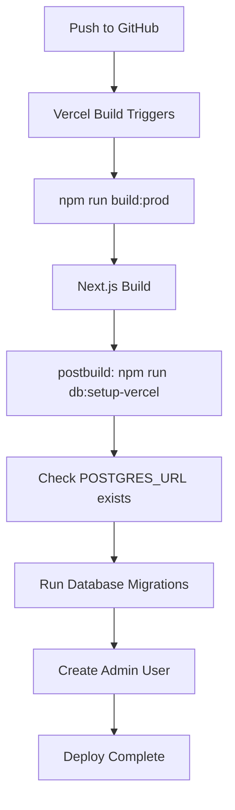

# ✅ Vercel PostgreSQL Setup Complete

## What's Been Done

### 1. Enhanced Database Adapter (`lib/db.ts`)
- ✅ Improved Vercel Postgres detection and connection logic
- ✅ Better error handling and logging for production
- ✅ Automatic switching between SQLite (dev) and PostgreSQL (prod)
- ✅ Optimized connection pooling for Vercel limits

### 2. Database Setup Script (`scripts/setup-vercel-postgres.ts`)
- ✅ Automatic database initialization on deployment
- ✅ Runs all required migrations
- ✅ Creates admin user with environment variables
- ✅ Safe re-run capability (won't duplicate data)

### 3. Updated Configuration Files
- ✅ **package.json**: Added `db:setup-vercel` and `postbuild` scripts
- ✅ **vercel.json**: Enhanced build configuration
- ✅ **.env.production.example**: Complete production environment template

### 4. Deployment Documentation
- ✅ **DEPLOYMENT.md**: Step-by-step Vercel deployment guide
- ✅ Complete troubleshooting section
- ✅ Security checklist and best practices

## Database Architecture

### Development (SQLite)
```
NODE_ENV=development → Uses ./hotdog_diaries_dev.db
```

### Production (Vercel Postgres)
```
NODE_ENV=production + POSTGRES_URL → Uses Vercel Postgres
```

## Deployment Flow



## Ready for Production ✅

Your Hotdog Diaries app is now configured to:

1. **Automatically switch** between SQLite (dev) and PostgreSQL (prod)
2. **Self-initialize** the database on first deployment
3. **Handle migrations** seamlessly
4. **Create admin user** from environment variables
5. **Scale efficiently** with Vercel's infrastructure

## Next Steps

### 1. Deploy to Vercel
```bash
# Ensure code is committed
git add .
git commit -m "Add Vercel PostgreSQL support"
git push origin main

# Then deploy via Vercel dashboard
```

### 2. Configure Environment Variables
Use the `.env.production.example` file as a reference to set all required environment variables in your Vercel project settings.

### 3. Test the Deployment
- Homepage: `https://your-app.vercel.app`
- Health check: `https://your-app.vercel.app/api/health`
- Admin login: `https://your-app.vercel.app/admin/login`

## Environment Variables Checklist

### Required (Blocking):
- [ ] `JWT_SECRET` (64+ characters)
- [ ] `JWT_REFRESH_SECRET` (64+ characters)
- [ ] `ADMIN_USERNAME`
- [ ] `ADMIN_PASSWORD`
- [ ] `ADMIN_EMAIL`
- [ ] `CORS_ORIGIN` (your Vercel app URL)
- [ ] `CRON_SECRET`

### Optional (Content Sources):
- [ ] `REDDIT_CLIENT_ID` & `REDDIT_CLIENT_SECRET`
- [ ] `YOUTUBE_API_KEY`
- [ ] `BLUESKY_IDENTIFIER` & `BLUESKY_PASSWORD`
- [ ] `UNSPLASH_ACCESS_KEY`
- [ ] `GIPHY_API_KEY`

### Automatic (Set by Vercel):
- [x] All `POSTGRES_*` variables (when you add PostgreSQL storage)

## Security Features Enabled

- ✅ **Database SSL**: Enabled for production
- ✅ **Connection pooling**: Optimized for Vercel limits
- ✅ **Environment isolation**: Dev/prod separation
- ✅ **Secure headers**: Via middleware
- ✅ **JWT authentication**: With rotation support
- ✅ **CORS protection**: Configurable origins

## Performance Optimizations

- ✅ **Query optimization**: Indexed columns and efficient queries
- ✅ **Connection reuse**: Proper pooling for serverless
- ✅ **Error recovery**: Automatic retry logic
- ✅ **Monitoring**: Query performance tracking

🚀 **Your app is production-ready for Vercel deployment!**