# CI Shepherd Runbook

This runbook covers the CI Shepherd system that manages automated deployments and integrates with the Production Watchdog.

## 🎯 Purpose

The CI Shepherd automates the deployment pipeline while ensuring production safety through:
- Pre-deployment validation via Production Watchdog
- Post-deployment verification and auto-revert capability
- Branch protection with required status checks

## 🔧 Branch Protection Setup

To enable production watchdog as a required check on the `main` branch:

### Step 1: Access Branch Protection Settings
1. Go to GitHub repository settings
2. Navigate to **Branches** in the left sidebar  
3. Click **Add rule** or edit existing rule for `main`

### Step 2: Configure Protection Rules
1. **Branch name pattern**: `main`
2. **Protect matching branches**: ✅ Checked
3. **Require status checks to pass before merging**: ✅ Checked
4. **Require branches to be up to date before merging**: ✅ Checked

### Step 3: Add Required Status Checks
In the "Status checks found in the last week" section, add:
- ✅ `prod-watchdog` (Production Watchdog check)
- ✅ Any other CI checks (e.g., `ci`, `build`, `test`)

### Step 4: Additional Protections (Recommended)
- **Require conversation resolution before merging**: ✅ Checked
- **Restrict pushes that create files to this branch**: ✅ Checked  
- **Require signed commits**: ✅ Checked (if using)

## 🚀 Deployment Flows

### Direct Push Mode
```bash
# Trigger direct deployment
gh workflow run auto-pr-ci-shepherd.yml --ref main
```

Flow:
1. **Preflight Check**: Production Watchdog runs on current state
2. **Deploy**: Push changes to main (if preflight passes)
3. **Post-deployment**: Production Watchdog validates deployment
4. **Auto-revert**: If post-deployment fails, automatic rollback

### PR Mode  
```bash
# Trigger PR-based deployment
gh workflow run auto-pr-ci-shepherd.yml --ref main -f pr_mode=true
```

Flow:
1. **Create PR**: Open pull request with changes
2. **Pre-merge Check**: Production Watchdog validates proposed changes
3. **Block/Proceed**: Add `watchdog-red` label and block if failing
4. **Merge**: Proceed to merge if all checks pass
5. **Post-merge**: Production Watchdog validates merged result
6. **Auto-revert**: Rollback if post-merge validation fails

## 📊 Integration Points

### Production Watchdog Integration
The CI Shepherd calls the Production Watchdog at key points:

```typescript
// Pre-deployment validation
pnpm tsx scripts/ops/ci-shepherd/run-and-wait-workflow.ts \
  --workflow .github/workflows/prod-watchdog.yml \
  --timeoutSec 900
```

Exit codes:
- `0`: GREEN status (proceed)
- `2`: YELLOW status (proceed with warning)  
- `1`: RED status (block/revert)

### Auto-Revert Capability
When post-deployment watchdog fails:
```bash
# Automatic rollback to last known good state
pnpm tsx scripts/ops/ci-shepherd/auto-revert.ts --target main
```

## 🔍 Monitoring & Debugging

### Check Recent Runs
```bash
# View shepherd runs
gh run list --workflow auto-pr-ci-shepherd.yml --limit 10

# View specific run
gh run view <run-id>

# Download artifacts (includes watchdog reports)
gh run download <run-id>
```

### Watchdog Reports
Each shepherd run generates:
- `ci_audit/shepherd/WATCHDOG_INVOKE.md` - Invocation details
- `ci_audit/watchdog/PROD_WATCHDOG_REPORT.md` - Full watchdog report

### Status Check Visibility
The `prod-watchdog` check appears in:
- PR status checks section
- Branch protection status
- Commit status indicators

## 🚨 Troubleshooting

### Watchdog Blocking Deployment
**Symptoms**: Pre-deployment check fails with RED status

**Actions**:
1. Review watchdog report in artifacts
2. Fix underlying issues (schedule, actions, UI)
3. Re-run deployment once resolved

### Post-Deployment Failures
**Symptoms**: Deployment succeeds but post-check fails

**Actions**:
1. Auto-revert should trigger automatically
2. If manual intervention needed:
   ```bash
   git revert <commit-sha>
   git push origin main
   ```

### Branch Protection Bypassing
**Symptoms**: Commits merged without watchdog check

**Actions**:
1. Verify branch protection rules are enabled
2. Check that `prod-watchdog` is in required status checks
3. Review administrator bypass settings

## 🔧 Auto-Remedy System

The CI Shepherd includes automated remediation capabilities that attempt to fix common production issues before reverting changes.

### Remediation Classes

**1. Schedule Issues (NO_SCHEDULE)**
- **Trigger**: Today < 6 slots or Tomorrow < 6 slots scheduled
- **Actions**: 
  - Dispatch `content-scheduler.yml` workflow
  - Run emergency schedule materialization for today/tomorrow
- **Safe**: Only triggers existing workflows, no code changes

**2. Queue Low (QUEUE_LOW)**
- **Trigger**: Less than 12 approved items in content queue
- **Actions**: 
  - Dispatch content scanning workflows (`scan-reddit.yml`, `scan-youtube.yml`, `scan-giphy.yml`)
  - Allows natural content ingestion to refill queue
- **Safe**: Uses existing scanners with built-in rate limits and approval flows

**3. Missed Posting (MISSED_EXECUTIONS)**
- **Trigger**: Past posting slots with `MISSING_EXECUTION` status
- **Actions**: 
  - Re-dispatch specific `post-*.yml` workflows for missed time slots
  - Maps slots to workflows: breakfast(08:00), lunch(12:00), snack(15:00), dinner(18:00), evening(21:00), late-night(23:30)
- **Safe**: Only triggers workflows that should have already run

**4. UI Health Failures (UI_HEALTH_FAIL)**
- **Trigger**: Any health endpoint returning non-200 or `ok: false`
- **Actions**: 
  - Create/update GitHub issue with diagnostic information
  - Includes failing endpoint details and raw probe data
- **Safe**: Read-only analysis, no system changes

### Auto-Remedy Flow

```mermaid
graph TD
    A[Watchdog RED] --> B[Auto-Remedy]
    B --> C[Analyze Failures]
    C --> D[Execute Safe Fixes]
    D --> E[Wait 30s for Settlement]
    E --> F[Re-run Watchdog]
    F --> G{Result?}
    G -->|GREEN/YELLOW| H[✅ Continue]
    G -->|RED| I[❌ Auto-Revert]
```



### Safety Guarantees

- **No Code Edits**: Auto-remedy never modifies application code
- **Idempotent Operations**: All remediation actions can be run multiple times safely
- **Existing Workflows Only**: Only triggers pre-approved GitHub Actions workflows
- **Timeout Protection**: 2-minute timeout per remediation command
- **Verification Required**: Post-remediation watchdog must pass or system reverts

### Monitoring Auto-Remedy

Auto-remedy generates detailed reports at:
- `ci_audit/shepherd/AUTOREMEDY_REPORT.md`

Report includes:
- Detected failure causes
- Actions taken with command results
- Links to triggered workflow runs
- Final verification status

## 🔗 Related Documentation

- [Production Watchdog Runbook](./prod-watchdog.md)
- [Posting Reliability Runbook](./posting-reliability.md)

---

*Last Updated: 2025-10-18*  
*Next Review: 2025-11-18*